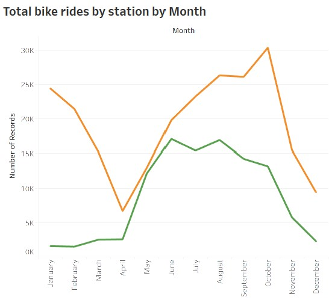

# Tableau- New York Citi Bike Analysis and Visualization




## Table of contents
* [Project Title ](#project-title)
* [Description](#description)
* [Objective](#objective)
* [Analysis](#analysis)
* [Screen Shots](#screen-shots)
* [Technologies](#technologies)
* [Code](#code)
* [Status](#status)
* [Acknowledgement ](#acknowledgement )
* [Contact](#contact)


## Project Title : NY Citi Bike Analytics

### Description 
This project aims at building a interactive dashboard using Tableau for city officials to analyze and answer the questions on the program.

### Data Set
- Since 2013, the Citi Bike Program has implemented a robust infrastructure for collecting data on the program's utilization. Through the team's efforts, each month bike data is collected, organized, and made public on the Citi Bike Data webpage.

## Objective
### Step 1 - Find Two Unexpected Phenomena

- Aggregate the data found in the Citi Bike Trip History Logs and find two unexpected phenomena.
- Design 2-5 visualizations for each discovered phenomena (4-10 total). 
	* You may work with a timespan of your choosing. Optionally, you may merge multiple datasets 	   from different periods.
### Step 2 - Design a dashboard for each phenomena.
- The dashboards should be accompanied with an analysis explaining why the phenomena may
	   be occurring.
	

### Step 3 - Build Maps
- A static map that plots all bike stations with a visual indication of the most popular locations to start and end a journey with zip code data overlaid on top

### Step 4 - Create a Tableau story
- Brings together the visualizations, requested maps, and dashboards.

### Analysis 2020

1. Most Riders in 2020 preferred pre fall and fall months. Line Chart shows most riders were subscribers and increase in rides could be after lockdown ended. 




## Screen Shots

### Step 1 - Interactive D3 chart with all the Risk factors:



## Technologies and Tools
* Tableau
* Jupyter Notebook
	

## Code 
- [Tableau Workbook](./NY Citi Bike Analytics.twbx)


## Status
Project Complete


## Contact
 [Divya Shetty](https://github.com/divya-gh)
