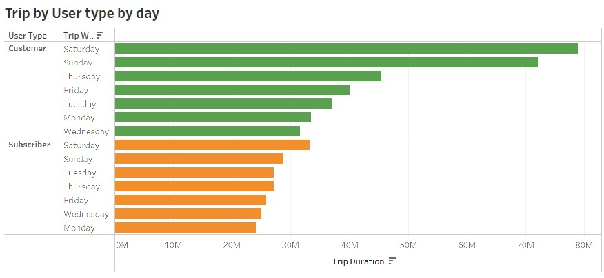
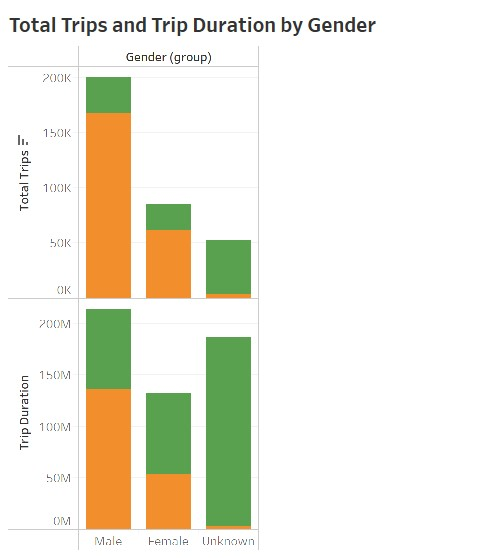
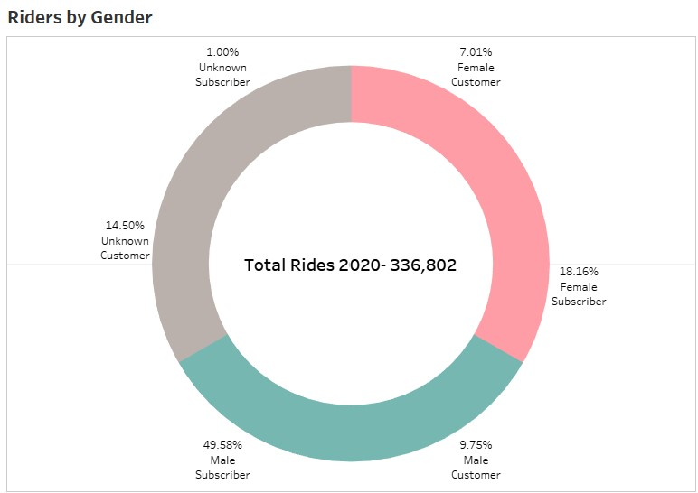
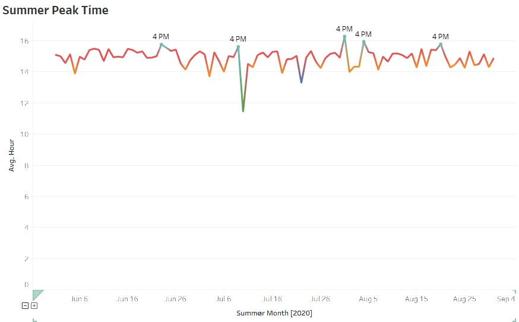
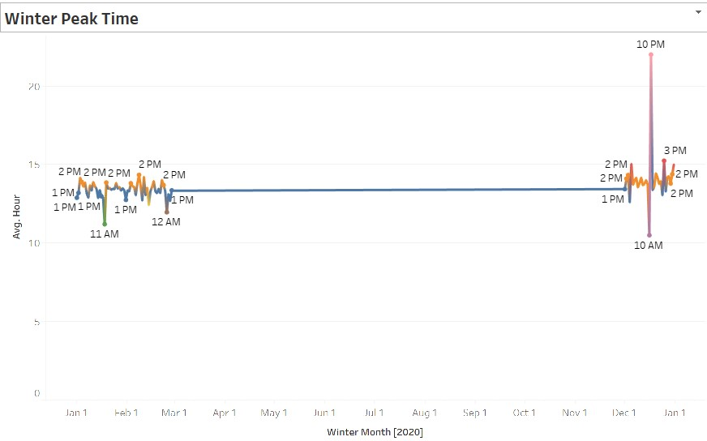
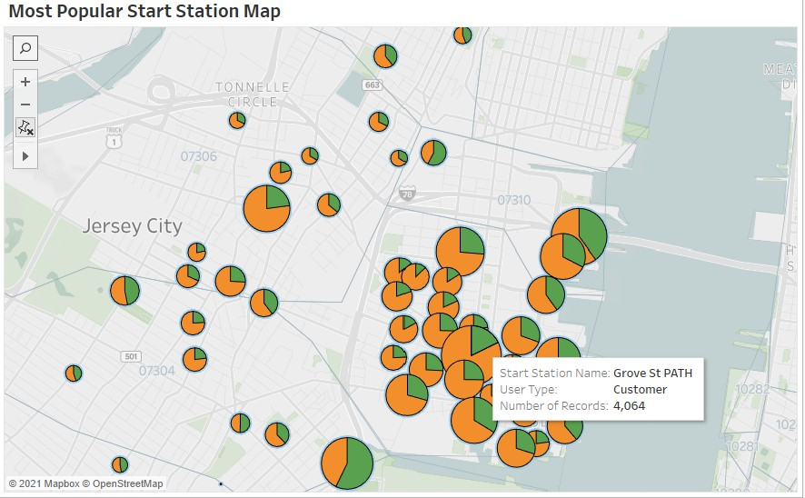
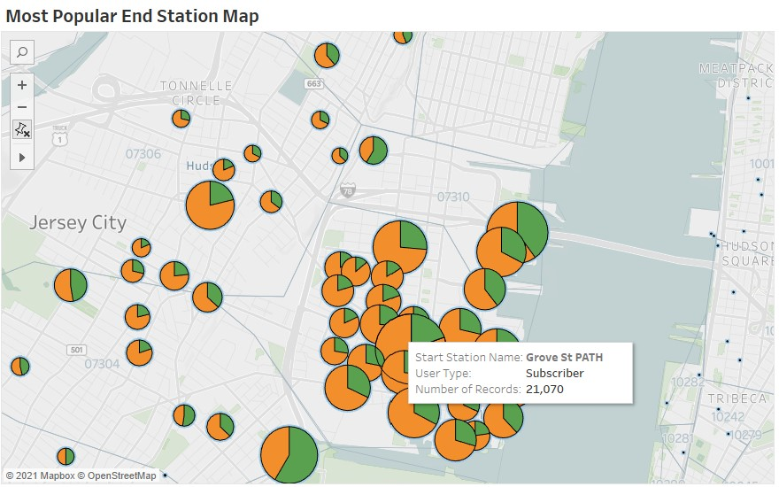

 
**New York Citi Bike Analysis and Visualization**
---

## Table of contents
* [Project Title](#description)
* [Description](#description)
* [Objective](#objective)
* [Analysis 2020](#analysis-2020)
* [Technologies and Tools](#technologies-and-tools)
* [Code](#code)
* [Status](#status)
* [Contact](#contact)

## Project Title : [NY Citi Bike Analytics](https://public.tableau.com/profile/divya.shetty#!/vizhome/NYCitiBikeAnalytics_16218206986070/NYCityBikeTripsStatistics?publish=yes)

### Description 
This project aims at building a interactive dashboard using Tableau for city officials to analyze and answer the questions on the program.

### Data Set
- Since 2013, the Citi Bike Program has implemented a robust infrastructure for collecting data on the program's utilization. Through the team's efforts, each month bike data is collected, organized, and made public on the Citi Bike Data webpage.

## Objective

### Step 1 - Find Two Unexpected Phenomena
  - Aggregate the data found in the Citi Bike Trip History Logs and find two unexpected phenomena.
  - Design 2-5 visualizations for each discovered phenomena (4-10 total). 	      
  * You may work with a timespan of your choosing. Optionally, you may merge multiple datasets 	   from different periods.
	    
### Step 2 - Design a dashboard for each phenomena.
- The dashboards should be accompanied with an analysis explaining why the phenomena may
	   be occurring.
	

### Step 3 - Build Maps
- A static map that plots all bike stations with a visual indication of the most popular locations to start and end a journey with zip code data overlaid on top

### Step 4 - Create a Tableau story
- Brings together the visualizations, requested maps, and dashboards.

## Analysis 2020
__phenomenon 1: User Type preference__

1. Most Riders in 2020 preferred pre fall and fall months. Line Chart shows that most riders were subscribers and increase in rides is seen after lockdown ended. Sudden drop after October could be due to the 2nd covid19 wave hitting NYC.

2. Although both Customers(1 or 3day pass holders) and subscribers prefer weekends, Most riders seen on weekends are customers.

__phenomenon 2: Riders by gender__

1. From the Charts below it's evident that 59% of the overall riders were males and only 25% were females. While there were little over 72% male subscribers, It isn't clear if there were more female customers over males since 46% of customers were unknown.

__phenomenon 3: Peak Time__

1. In summer, 4PM seems to the peak time. 

2. In Winter, 3PM seems to the peak time. peak 10PM in December could be New Years eve traffic.

__Map : Most popular Start and End Station__
Map below shows the most popular start and end stations by user type.

## Technologies and Tools
* Tableau
* Jupyter Notebook
	

## Code 
[Download Tableau Workbook](./NY-Citi-Bike-Analytics.twbx)

## Tableau Public Workbook 
[Tableau Workbook](https://public.tableau.com/profile/divya.shetty#!/vizhome/NYCitiBikeAnalytics_16218206986070/NYCityBikeTripsStatistics?publish=yes)

## Status
Project Complete

## Contact
 [Divya Shetty](https://github.com/divya-gh)
